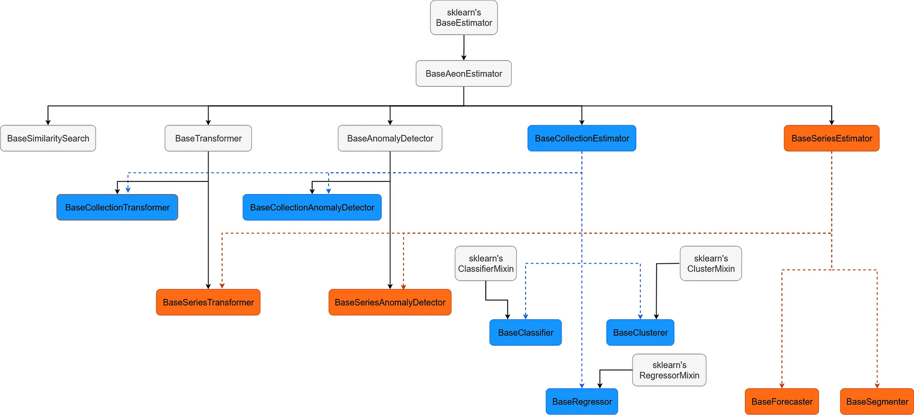
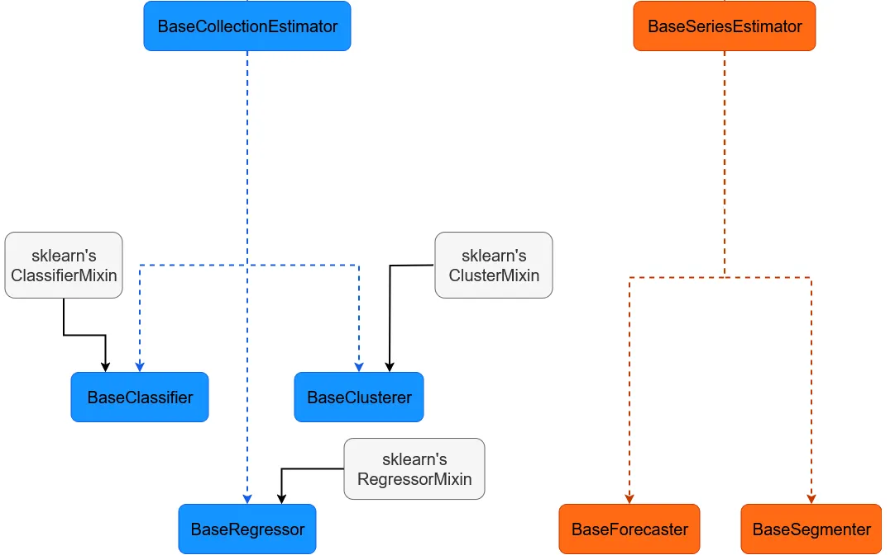
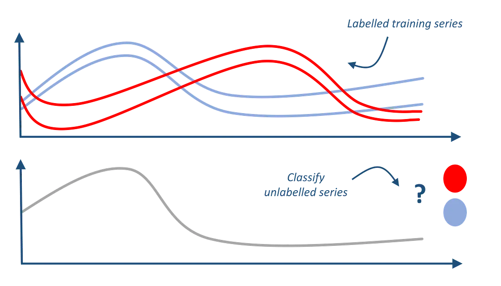
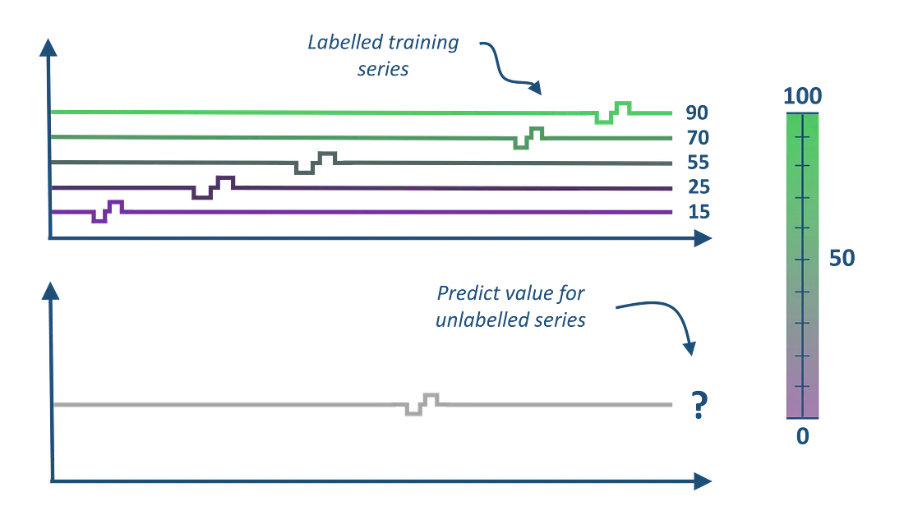
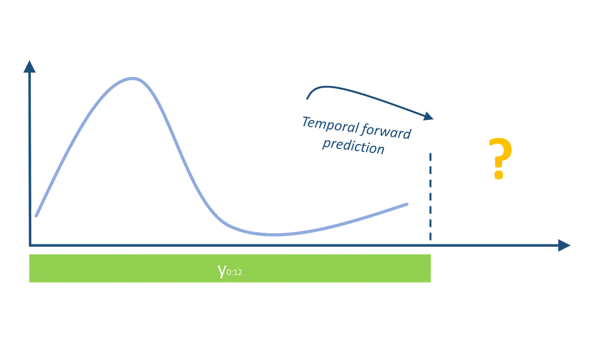
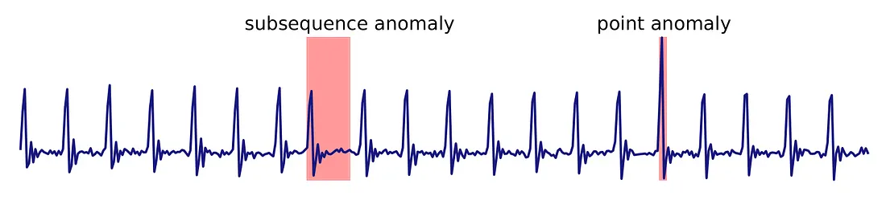

# Leveraging aeon for streamlined time series algorithm development

I've spent a lot of time developing time series algorithms, and I got tired of writing the same input checking and conversion code over and over. I just wanted to focus on the algorithm itself.

In this post, I'll show you how aeon's base classes handle all the boring stuff—input checking, type conversion, validation—so you can focus on the algorithm logic.

Let's dive in!

<!-- more -->

## What is aeon?


For those unfamiliar, aeon is a comprehensive toolkit for time series. It has algorithms for forecasting, classification, anomaly detection, plus tools to load, process, and evaluate your data.

aeon is a NumFocus open-source project maintained by developers from industry and academia. If you know scikit-learn, you'll feel at home—aeon follows the same design patterns.

Want to know more about the project? Check out the [documentation website](https://www.aeon-toolkit.org/) or the [GitHub repository](https://github.com/aeon-toolkit/aeon)!

## How aeon helps you build time series machine learning algorithms

aeon uses an inheritance hierarchy with specialized subclasses in each module. To build an algorithm, you pick the right base class and inherit from it. Here's the basic hierarchy:


*How aeon's base class hierarchy is organized*

### Scikit-learn and aeon base estimator

Everything in aeon inherits from sklearn's `BaseEstimator`, which handles parameter getting and setting via `set_params` and `get_params`. This is used when estimators interact with things like `GridSearchCV`.

Then there's `BaseAeonEstimator`, which handles:

- tag management and interaction with sklearn's tags
- cloning and resetting estimators
- creating test instances with fast-running configs (e.g., a forest with 2 trees) for CI/CD pipelines

### A word on aeon's tag system
Tags display estimator capabilities in the docs and enable specific tests. Check the developer documentation for all available tags and how they're used in testing.
class RandomDilatedShapeletTransform(BaseCollectionTransformer):

    ...

    # Example of the tags defined by the RDST transformation
    _tags = {
        "output_data_type": "Tabular",
        "capability:multivariate": True,
        "capability:unequal_length": True,
        "capability:multithreading": True,
        "X_inner_type": ["np-list", "numpy3D"],
        "algorithm_type": "shapelet",
    }
```

Tags are mainly used for input/output formatting and checking. Key tags:

- `X_inner_type`: specifies the input type your code uses (Arrays, DataFrames, Lists). Your algorithm can accept numpy arrays and pandas DataFrames, even if your code only uses numpy arrays.
- `output_data_type`: specifies output type (tabular, series, collections). Mostly for transformers.
- `capability:multivariate`: handles multivariate time series.
- `capability:unequal_length`: handles unequal length collections.
- `capability:multithreading`: supports parallel processing.

Tags also indicate behaviors and optional dependencies. Example:

```python
class LITETimeClassifier(BaseClassifier):

    ...

    # Example of the tags defined by the LITE Classifier
    _tags = {
        "python_dependencies": "tensorflow",
        "capability:multivariate": True,
        "non_deterministic": True,
        "cant_pickle": True,
        "algorithm_type": "deeplearning",
    }
```

More examples below.

## Collection estimator and Series estimator


*Collection vs Series estimators in aeon*

In aeon, there are two input types: series and collections.

- **Series**: single time series in 2D format `(n_channels, n_timepoints)`, or 1D `(n_timepoints)` for univariate. Series estimators have an `axis` parameter to transpose between `(n_channels, n_timepoints)` and `(n_timepoints, n_channels)`.
- **Collections**: multiple time series in 3D format `(n_samples, n_channels, n_timepoints)`. Sometimes 2D `(n_samples, n_timepoints)` for univariate, though I prefer avoiding this to reduce confusion.

For unequal length collections, use a list of 2D arrays where `n_timepoints` varies—that's the `np-list` in the RDST example.

`BaseClassifier` inherits from `BaseCollectionEstimator`, so all classifiers expect collections as inputs.

### Collection estimators

`BaseCollectionEstimator` checks input shape, extracts metadata (like whether it's multivariate), and validates against estimator tags. Example:

```python
from aeon.classification.dictionary_based import TemporalDictionaryEnsemble
from aeon.testing.data_generation import make_example_3d_numpy_list
# TDE does not support unequal length collections
# as it sets "capability: unequal_length":False
X_unequal, y_unequal = make_example_3d_numpy_list()
try:
    TemporalDictionaryEnsemble().fit(X_unequal, y_unequal)
except ValueError as e:
    print(e)
```

```
Data seen by instance of TemporalDictionaryEnsemble has unequal length series,
but TemporalDictionaryEnsemble cannot handle these characteristics.
```

What happens: `TemporalDictionaryEnsemble` → `BaseClassifier` → `BaseCollectionEstimator`. During fit/predict, `BaseClassifier` calls `_preprocess_collection`, which extracts metadata and compares it to the estimator's tags. Since this estimator doesn't support unequal lengths, it raises an exception.

### Classification


*Illustration of the time series classification task*

`BaseClassifier` follows sklearn's `fit`, `predict`, and `predict_proba` pattern. These methods call abstract `_fit` and `_predict` that you implement. Format checking and conversion happens automatically before your methods are called.

To build a classifier, implement `__init__`, `_fit`, and `_predict`, then set the tags. `BaseClassifier` gives you `classes_`, `n_classes_`, and `_class_dictionary`:

```python
from numpy.random import default_rng
from aeon.classification import BaseClassifier
from aeon.testing.data_generation import (
    make_example_3d_numpy,
    make_example_dataframe_list,
)

class RandomClassifier(BaseClassifier):
    """A dummy classifier returning random predictions."""
    _tags = {
        "capability:multivariate": True,  # allow multivariate collections
        "capability:unequal_length": True,  # allow multivariate collections
        "X_inner_type": ["np-list", "numpy3D"],  # Specify data format used internally
    }
    def __init__(self, random_state: int | None = None):
        self.random_state = random_state
        super().__init__()
    def _fit(self, X, y):
        self.rng = default_rng(self.random_state)
        return self
    def _predict(self, X):
        # generate a random int between 0 and n_classes-1 and
        # use _class_dictionary to convert it to class label
        return [
            self._class_dictionary[i]
            for i in self.rng.integers(low=0, high=self.n_classes_, size=len(X))
        ]
# A 3D numpy array 
X, y = make_example_3d_numpy(n_channels=2)
print(RandomClassifier().fit_predict(X, y))
# A list of dataframes, each representing a 2D Series
X, y = make_example_dataframe_list()
print(RandomClassifier().fit(X, y).predict(X))
```

```
[1 0 1 1 0 0 1 0 1 0]
[0 1 1 0 0 1 0 1 0 0]
```

**Further reading:** [Introduction to time series classification using aeon](https://www.aeon-toolkit.org/en/stable/examples/classification/classification.html)

### Regression, Clustering and Anomaly detection


*Illustration of the time series regression task*

These work like `BaseClassifier`, using the same checks and conversions from `BaseCollectionEstimator`.

`BaseRegressor` has `fit` and `predict`, needs `_fit` and `_predict`. No `predict_proba` yet—we're still figuring out probabilistic regression. Different y validation since targets are floats.

`BaseClusterer` has `fit` and `predict` without y (unsupervised). Does include `predict_proba`.

`BaseCollectionAnomalyDetector` same—`fit` and `predict` without y.

**Further reading:**

- [What is time series extrinsic regression?](https://www.aeon-toolkit.org/en/stable/examples/regression/regression.html)
- [Time series clustering using aeon](https://www.aeon-toolkit.org/en/stable/examples/clustering/clustering.html)
- [Time series anomaly detection using aeon](https://www.aeon-toolkit.org/en/stable/examples/anomaly_detection/anomaly_detection.html)

### Collection transformation

`BaseCollectionTransformer` has `fit`, `transform`, and `fit_transform` (inherits from `BaseTransformer`). You implement `_fit` and `_transform`. Specify output type with `output_data_type`.

If output is another collection (e.g., after SAX), use `output_data_type="Collection"` (the default). If output is features (like Rocket or RandomShapeletTransform), use `output_data_type="Tabular"`.

**Further reading:** [Time series transformation with aeon](https://www.aeon-toolkit.org/en/stable/examples/transformations/transformations.html)

## Series estimators

Series estimators work with single time series. They inherit from `BaseSeriesEstimator`, which does the same input checks and conversions as `BaseCollectionEstimator`, but for single series.

The key difference is the `axis` parameter—it specifies whether you're using `(n_channels, n_timepoints)` or `(n_timepoints, n_channels)`. This is needed because we can't automatically infer the format.

Two uses of `axis`:

- During initialization: defines the internal format
- In method calls: transposes input if needed to match internal format

Note: `axis=0` means timepoints in first dimension, `axis=1` means second dimension (i.e., `(n_channels, n_timepoints)`).

**Further reading:** [aeon series estimators](https://www.aeon-toolkit.org/en/stable/examples/transformations/series.html)

### Series transformation

`BaseSeriesTransformer` is the base for all series transformers. It has `fit`, `transform`, and `fit_transform`. You implement `_fit` and `_transform`. Example:

```python
from aeon.testing.data_generation import make_example_dataframe_series
from aeon.transformations.series import BaseSeriesTransformer

class DummySeriesTransformer(BaseSeriesTransformer):
    """A dummy series transformer that keeps every second timepoint."""
    _tags = {
        "capability:multivariate": True,  # allow multivariate series
        "X_inner_type": "pd.DataFrame",  # Specify data format used internally
        "fit_is_empty": True,  # we don't need to define _fit
    }
    def __init__(self):
        super().__init__(axis=1)  # Set axis to 1 for (n_channels, n_timepoints) format
    def _transform(self, X, y=None):
        print(X.shape)
        X = X.iloc[:, ::2]  # Example transformation: keep every second timepoint
        print(X.shape)
        return X

X = make_example_dataframe_series(n_channels=2, n_timepoints=10).T
print(X.shape)  # Is (n_timepoints, n_channels), which is axis=0
print(DummySeriesTransformer().fit_transform(X, axis=0).shape)
```

```
(10, 2)
(2, 10)
(2, 5)
(5, 2)
```

X starts as `(n_timepoints, n_channels)`, the default format.

`DummySeriesTransformer` has `axis=1`, so input gets converted to `(n_channels, n_timepoints)` before `_fit` and `_transform`, then back to `axis=0 : (n_timepoints, n_channels)` for output.

Since `X_inner_type` is `pd.DataFrame`, non-DataFrame inputs get converted automatically. You write code for one format, aeon handles the rest.

```python
from aeon.testing.data_generation import make_example_2d_numpy_series
X = make_example_2d_numpy_series(n_channels=1, n_timepoints=10)
transformer = DummySeriesTransformer()
print(transformer.fit_transform(X, axis=1).shape)
```

```
(1, 10)
(1, 5)
(1, 5)
```

### Forecasting


*Illustration of the time series forecasting task*

`BaseForecaster` inherits from `BaseSeriesEstimator`. It predicts `horizon` steps ahead (set during initialization). Main methods:
- `fit(y, exog=None)`: train
- `predict(y, exog=None)`: predict
- `forecast(y, exog=None)`: fit + predict

Implement `_fit` and `_predict`. Two forecasting strategies:

- `direct_forecast()`: separate models for each step
- `iterative_forecast()`: recursive predictions with one model

**Further reading:** [Time Series Forecasting with aeon](https://www.aeon-toolkit.org/en/stable/examples/forecasting/forecasting.html)

### Anomaly detection and Segmentation


*Illustration of time series anomaly detection*

`BaseSeriesAnomalyDetector` and `BaseSegmenter` have `fit` and `predict`, but you only implement `_predict` (most are unsupervised). Both inherit from `BaseSeriesEstimator` for checks and conversions.

**Further reading:** [Introduction to time series segmentation](https://www.aeon-toolkit.org/en/stable/examples/segmentation/segmentation.html)

## What's next?

I hope this helps you see how aeon's base classes can make your estimators more robust. Questions? Want to contribute? Join us on [Slack](https://join.slack.com/t/aeon-toolkit/shared_invite/zt-1plkevy7h-VL3T6yqGTpJxFf_l9_aNOg) or check the [open issues on GitHub](https://github.com/aeon-toolkit/aeon/issues)!